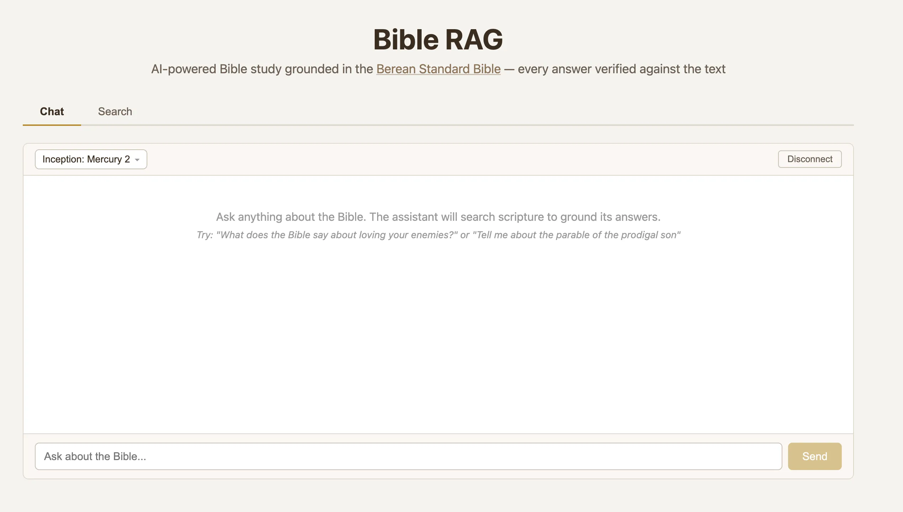

# Bible RAG



AI-powered Bible study grounded in actual scripture. Chat with an LLM that searches the Berean Standard Bible (31,086 verses) in real-time, ensuring every answer is verified against the source text — not recalled from memory.

## Why RAG?

Large language models know the Bible well and can mostly recall scripture accurately, but not always perfectly. They may paraphrase, conflate passages, or subtly alter wording. Bible RAG solves this by grounding every response in the actual verse text:

- The LLM uses **semantic search** and **direct verse lookup** tools to find relevant passages before answering
- Every quoted verse comes from the Berean Standard Bible (BSB) text, not the model's training data
- You can inspect exactly which verses were retrieved by expanding the tool call details inline

## Features

### Chat Mode (default)
- Connect to [OpenRouter](https://openrouter.ai) via OAuth (free tier available)
- Choose from hundreds of models with a searchable model picker showing pricing and context length
- LLM has two tools: `search_bible` (semantic search) and `lookup_passage` (direct reference lookup)
- Streaming responses with inline thinking and tool call visibility
- Stop button to cancel generation while keeping streamed content

### Search Mode
- Direct semantic search across all 31,086 verses grouped into 1,189 chapters
- Verse-level relevance heatmaps with auto-scroll to best matching passage
- Ranked by `max(sliding_window_2, sliding_window_3, 0.94 × max_single_verse)`

## How It Works

Uses **MongoDB/mdbr-leaf-ir** (22M params) for both document and query embeddings (symmetric):
- **Offline**: Python generates verse-level embeddings (768-dim, stored as float16)
- **In-browser**: ONNX model loaded via `@huggingface/transformers`, with a Dense projection layer (384→768) applied in JS
- Verses scored by cosine similarity; chapters ranked by best sliding window score
- Chat tool calls run the same embedding + search pipeline in-browser

## Quick Start

### 1. Generate Embeddings

```bash
pip install sentence-transformers torch
python scripts/generate_embeddings.py
```

Outputs to `public/data/`:
- `verses_embeddings.bin` + `verses_index.json` (~45 MB) — all verse embeddings (float16)
- `verses/*.json` (1,189 files) — per-chapter verse text
- `dense_layer.bin` (~1.2 MB) — Dense projection weights for in-browser inference

### 2. Run the Web App

```bash
npm install
npm run dev
```

### 3. Build for Production

```bash
npm run build
```

Static files output to `dist/`. Deploy to any static host.

## Usage

### Chat
1. Click "Connect to OpenRouter" (free account, no credit card needed)
2. Ask questions about the Bible — the LLM will search scripture automatically
3. Expand tool calls to see exactly which verses were retrieved
4. Use "New Chat" to start a fresh conversation

### Search
1. Switch to the Search tab
2. Type a descriptive query (longer queries work better than keywords)
3. Click a chapter result to see verse-level relevance heatmap
4. Warmer colors = higher semantic relevance to your query
